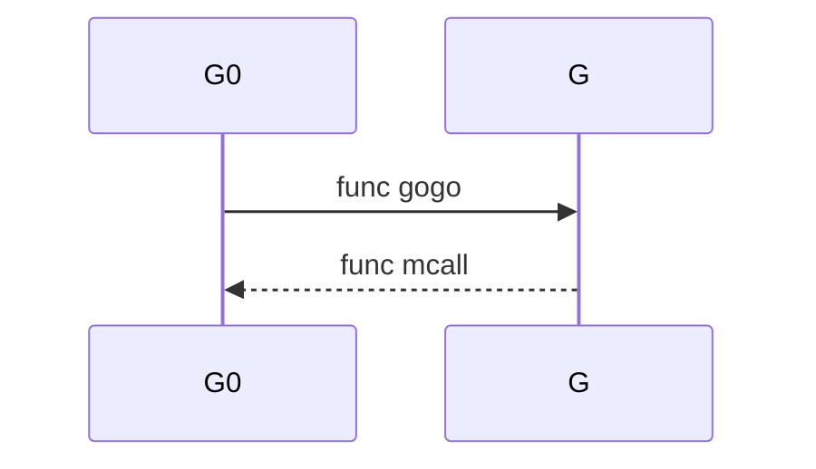

+++
title = 'GMP调度原理解析'
date = 2024-02-06T22:00:00+08:00
+++

源码版本1.21.6

GMP是Golang中的一种调度模型

G：指Golang中的协程（**Goroutine**）

M：指一种线程的抽象（Machine）

P：指调度器（Processor）

GMP调度大致可以简化为这样的关系

Goroutine ———调度器——— 线程

通过调度器来实现线程对于Goroutine的调用，而不是对线程和Goroutine进行绑定

调度流程：

从内核态———>用户态

- 由CPU发送指令到操作系统调度器进行接收
- 操作系统对（M）内核线程进行调用
- （M）内核线程需要对（P）调度器 进行绑定，然后才能对（G）Goroutine进行调用
- 在接受到指令后，每个内核线程（M）会先去尝试从他们维护的本地队列中获取（G）Goroutine
- 如果本地队列中没有获取到（G）Goroutine，那么他们会尝试获取全局队列中的（G）Goroutine —————这里的全局队列是所有P都可以访问的公共队列，所以需要加锁，导致性能没有本地队列那么好
- 如果本地队列和全局队列中都没有（G）Goroutine了怎么办？那么（P）调度器  会尝试向其他的（P）调度器进行“窃取”部分的（G）Goroutine到自己的本地队列中去（会加锁）

GMP的数据结构在runtime包中

```go
go/src/runtime/runtime2.go
```

主要字段有以下几种

在

```go
type g struct {
	// .......
	m         *m      // current m; offset known to arm liblink
	sched     gobuf
	// .......
}
```

```go
type m struct {
	// .......
	g0      *g     // goroutine with scheduling stack
	tls           [tlsSlots]uintptr // thread-local storage (for x86 extern register)
	curg          *g       // current running goroutine
	p             puintptr // attached p for executing go code (nil if not executing go code
	// .......
}
```

在m中，我们可以看到有一个g0

```go
type p struct {
	m           muintptr   // back-link to associated m (nil if idle)
	// Queue of runnable goroutines. Accessed without lock.
	runqhead uint32
	runqtail uint32
	runq     [256]guintptr
	// runnext, if non-nil, is a runnable G that was ready'd by
	// the current G and should be run next instead of what's in
	// runq if there's time remaining in the running G's time
	// slice. It will inherit the time left in the current time
	// slice. If a set of goroutines is locked in a
	// communicate-and-wait pattern, this schedules that set as a
	// unit and eliminates the (potentially large) scheduling
	// latency that otherwise arises from adding the ready'd
	// goroutines to the end of the run queue.
	//
	// Note that while other P's may atomically CAS this to zero,
	// only the owner P can CAS it to a valid G.
	runnext guintptr
}
```

```go
type gobuf struct {
	// The offsets of sp, pc, and g are known to (hard-coded in) libmach.
	//
	// ctxt is unusual with respect to GC: it may be a
	// heap-allocated funcval, so GC needs to track it, but it
	// needs to be set and cleared from assembly, where it's
	// difficult to have write barriers. However, ctxt is really a
	// saved, live register, and we only ever exchange it between
	// the real register and the gobuf. Hence, we treat it as a
	// root during stack scanning, which means assembly that saves
	// and restores it doesn't need write barriers. It's still
	// typed as a pointer so that any other writes from Go get
	// write barriers.
	sp   uintptr
	pc   uintptr
	g    guintptr
	ctxt unsafe.Pointer
	ret  uintptr
	lr   uintptr
	bp   uintptr // for framepointer-enabled architectures
}
```

```go
// defined constants
const (
	//表示Goroutine刚被分配并且尚未初始化
	_Gidle = iota // 0

	//表示Goroutine在运行队列中，随时准备就绪被调用
	_Grunnable // 1

	//表示Goroutine可能正在执行用户代码。此时Goroutine的栈由该Goroutine所拥有，它不在运行队列中，已经分配了M和P
	_Grunning // 2

	//表示Goroutine正在执行系统调用，而非用户代码。此时Goroutine的栈由该Goroutine所拥有，不在运行队列中，已经分配了M
	_Gsyscall // 3

	//表示Goroutine被阻塞在运行时系统中，而不是执行用户代码。此时Goroutine的栈不被所有权，但可能被记录在某个地方（如通道等待队列），以便在需要时进行唤醒。
	_Gwaiting // 4

	//表示Goroutine当前未使用。它可能刚刚退出、在空闲列表上，或者正在初始化。G和其栈（如果有的话）由正在退出的M或从空闲列表中获取G的M所拥有
	_Gdead // 6

	//表示Goroutine的栈正在被移动，而不是执行用户代码。此时Goroutine的栈由放置它在_Gcopystack状态的Goroutine所拥有
	_Gcopystack // 8

	//表示Goroutine因为自我停止以进行预抢占。类似于_Gwaiting，但目前还没有什么负责ready()这个G的
	_Gpreempted // 9

	//表示一些上述状态的组合
	_Gscan          = 0x1000
	_Gscanrunnable  = _Gscan + _Grunnable  // 0x1001
	_Gscanrunning   = _Gscan + _Grunning   // 0x1002
	_Gscansyscall   = _Gscan + _Gsyscall   // 0x1003
	_Gscanwaiting   = _Gscan + _Gwaiting   // 0x1004
	_Gscanpreempted = _Gscan + _Gpreempted // 0x1009
)
```

一个Goroutine的执行流程大致就是这样


_Gidle：表示Goroutine刚被分配并且尚未初始化

_Gdead：初始化

_Grunnable：进入运行队列，随时可以被调用

在进行running的时候可能会进入到两种状态

_Gsyscall：如果需要进入内核态进行系统调用的话，就会进入_Gsyscall，在系统调用完成之后，它会重新回到_Grunnable的状态，等待调度

_Gwaiting：一种被动阻塞状态，比如尝试加锁访问，但是目前该资源已经被别人加锁了，比如向无缓存管道发送消息时，但是没有接收方，那么也会被动阻塞（在某些条件达成时会被唤醒，重新回到_Grunnable的状态）不然就是死锁了

_Gdead：当函数执行完成后，最后会进入_Gdead的状态，进行销毁回收

```go
type schedt struct {
	//全局队列的锁
	lock mutex

	// freem is the list of m's waiting to be freed when their
	// m.exited is set. Linked through m.freelink.
	//待释放的M的链表
	freem *m

	// Global runnable queue.

	//全局 goroutine 队列
	runq     gQueue
	//全局 goroutine 队列的容量
	runqsize int32
}
```

每个M都有对应的G0

M需要和P绑定才能运行G

关于G的创建

```go
// Create a new g running fn.
// Put it on the queue of g's waiting to run.
// The compiler turns a go statement into a call to this.
func newproc(fn *funcval) {
	gp := getg()
	pc := getcallerpc()
	systemstack(func() {
		newg := newproc1(fn, gp, pc)

		pp := getg().m.p.ptr()
		runqput(pp, newg, true)

		if mainStarted {
			wakep()
		}
	})
}
```

Goroutine需要在被M调度时才能执行G的创建

创建出来的G会依据创建他的G找到对应的M再找到对应的P队列

如果当前P队列有空闲就会加入，如果没有的话就加入全局队列

关于G的切换

G的类型分为两类：G0和G

G是被G0进行调度的

G0:是一种特殊的协程，他和M是1:1的关系，负责执行g之间的调度

G：负责执行普通的用户态函数

```go
runtime/stubs.go

func gogo(buf *gobuf)

// mcall switches from the g to the g0 stack and invokes fn(g),
// where g is the goroutine that made the call.
// mcall saves g's current PC/SP in g->sched so that it can be restored later.
// It is up to fn to arrange for that later execution, typically by recording
// g in a data structure, causing something to call ready(g) later.
// mcall returns to the original goroutine g later, when g has been rescheduled.
// fn must not return at all; typically it ends by calling schedule, to let the m
// run other goroutines.
//
// mcall can only be called from g stacks (not g0, not gsignal).
//
// This must NOT be go:noescape: if fn is a stack-allocated closure,
// fn puts g on a run queue, and g executes before fn returns, the
// closure will be invalidated while it is still executing.
func mcall(fn func(*g))
```

G0和G的关系：m 通过 p 调度执行的 goroutine 永远在普通 g 和 g0 之间进行切换，当 g0 找到可执行的 g 时，会调用 gogo 方法，调度 g 执行用户定义的任务；当 g 需要主动让渡或被动调度时，会触发 mcall 方法，将执行权重新交还给 g0.



Goroutine调度类型：

（这里指的是调度器 p 实现从执行一个 g 切换到另一个 g 的过程）

```go
runtime/proc.go

// Gosched yields the processor, allowing other goroutines to run. It does not
// suspend the current goroutine, so execution resumes automatically.
//
//go:nosplit
func Gosched() {
	checkTimeouts()
	mcall(gosched_m)
}
```

- 主动调度:由用户主动发起的调度，当用户在执行代码中调用Gosched方法时，此时当前 g 会让出执行权，回到runable状态，主动进行队列，等待下次被调度执行

```go
// Puts the current goroutine into a waiting state and calls unlockf on the
// system stack.
//
// If unlockf returns false, the goroutine is resumed.
//
// unlockf must not access this G's stack, as it may be moved between
// the call to gopark and the call to unlockf.
//
// Note that because unlockf is called after putting the G into a waiting
// state, the G may have already been readied by the time unlockf is called
// unless there is external synchronization preventing the G from being
// readied. If unlockf returns false, it must guarantee that the G cannot be
// externally readied.
//
// Reason explains why the goroutine has been parked. It is displayed in stack
// traces and heap dumps. Reasons should be unique and descriptive. Do not
// re-use reasons, add new ones.
func gopark(unlockf func(*g, unsafe.Pointer) bool, lock unsafe.Pointer, reason waitReason, traceReason traceBlockReason, traceskip int) {
	if reason != waitReasonSleep {
		checkTimeouts() // timeouts may expire while two goroutines keep the scheduler busy
	}
	mp := acquirem()
	gp := mp.curg
	status := readgstatus(gp)
	if status != _Grunning && status != _Gscanrunning {
		throw("gopark: bad g status")
	}
	mp.waitlock = lock
	mp.waitunlockf = unlockf
	gp.waitreason = reason
	mp.waitTraceBlockReason = traceReason
	mp.waitTraceSkip = traceskip
	releasem(mp)
	// can't do anything that might move the G between Ms here.
	mcall(park_m)
}

func goready(gp *g, traceskip int) {
	systemstack(func() {
		ready(gp, traceskip, true)
	})
}

```

- 被动调度：

因当前不满足某种执行条件（通常是等待channel或是互斥锁），g 可能会陷入阻塞态无法被调度，直到关注的条件达成后，g才从阻塞中被唤醒，重新进入可执行队列等待被调度.

常见的被动调度触发方式为因 channel 操作或互斥锁操作陷入阻塞等操作，底层会走进 gopark 方法.(这里会进入waiting状态)，同时会把这个G和对应的P进行解绑，然后G0会尝试获取下一个可以被调度的G

引起这一次被动调度的工具本身负责维护存储陷入waiting状态的G.

当原来的G到达了可以唤醒的时候，会在某一个P的G0的执行过程中调用goready方法，让G重新进入runnable状态，会优先把这个唤醒的G加入唤醒它的G0所对应的P的本地队列中

会放入到这个P的runnext字段，这个P下次调度的时候就会调用这个被唤醒的G

- 正常调度：就是正常运行任务完成
- 抢占调度：

引入一个新角色：

全局异步监控者协程：monitor

因为发起系统调用时，会进入内核态，从内核视角来看，这时 m 也会因系统调用而陷入僵直，无法主动完成抢占调度的行为.于是我们就需要monitor

当某个G的发起的系统调用的时长是否超过了一定的阈值，monitor会通过不断轮询检测到，如果达到阙值，这时monitor会强行把这个G和它对应的P解绑，被中断的 Goroutine 不会立即被销毁，而是暂时停止执行，等待调度器再次调度它。在等待期间，这个 Goroutine 会被放入调度器的本地/全局队列中，等待调度器决定何时重新分配时间片并继续执行。（标记为waiting）被中断的 Goroutine 可能并不是立即重新执行，因为调度器可能会根据一些策略和优先级来决定下一个执行的 Goroutine。

monitor会把p抽离出来，调度到正常可以执行的m下，然后尝试执行后续的操作

**协程调度器主动触发：** 在某些情况下，调度器可能会主动触发抢占调度，以确保系统的响应性和公平性。例如，在进行垃圾回收（GC）时，调度器可能会中断正在运行的 Goroutine，以便执行 GC 所需的操作。

宏观调度流程

G0和G相关的调度

蓝色：G0

红色：G

G0通过执行schedule() 函数，寻找到用于执行的 G

G0 执行 execute() 方法，更新当前 G、P 的状态信息，并调用 gogo() 方法，将执行权交给 G；

G 因主动让渡( gosche_m() )、被动调度( park_m() )、正常结束( goexit0() )等原因，调用 m_call 函数，执行权重新回到 G0 手中

G0 执行 schedule() 函数，开启新一轮循环


G0调度G的流程


在本地队列中暂时获取不到时会尝试去向全局队列获取

如果全局队列也获取不到时会尝试获取就绪的I/O协程

如果网络协程也获取不到，那么就会尝试偷取其他P的本地队列中的一半的G

p 每执行 61 次调度，会从全局队列中获取一个 goroutine 进行执行，并将一个全局队列中的 goroutine 填充到当前 p 的本地队列中(防止本地队列一直繁忙导致全局队列饥饿)

```go
runtime/proc.go

func findRunnable

top:
	pp := mp.p.ptr()
	

	// Check the global runnable queue once in a while to ensure fairness.
	// Otherwise two goroutines can completely occupy the local runqueue
	// by constantly respawning each other.
	//这里是每61次调度进行的循环
	//schedtick 调度进度
	if pp.schedtick%61 == 0 && sched.runqsize > 0 {
	lock(&sched.lock)//进行加锁
	gp := globrunqget(pp, 1)//从全局队列中获取一个G
	unlock(&sched.lock)
	if gp != nil {
	return gp, false, false
	}

	// local runq
	//如果不是第61次调度的话，会优先从本地队列调G
	if gp, inheritTime := runqget(pp); gp != nil {
		return gp, inheritTime, false
	}
	//如果本地队列没有获取到
	// global runq
	//尝试从全局队列中获取goroutine
	if sched.runqsize != 0 {
		lock(&sched.lock)
		gp := globrunqget(pp, 0) //
		unlock(&sched.lock)
		if gp != nil {
			return gp, false, false
		}
	}

	// Poll network.
	// This netpoll is only an optimization before we resort to stealing.
	// We can safely skip it if there are no waiters or a thread is blocked
	// in netpoll already. If there is any kind of logical race with that
	// blocked thread (e.g. it has already returned from netpoll, but does
	// not set lastpoll yet), this thread will do blocking netpoll below
	// anyway.
	// 如果全局队列中也没有获取到goroutine，那么就尝试获取处于就绪态的I/O协程
	if netpollinited() && netpollAnyWaiters() && sched.lastpoll.Load() != 0 {
		if list, delta := netpoll(0); !list.empty() { // non-blocking
			gp := list.pop()
			injectglist(&list)
			netpollAdjustWaiters(delta)
			trace := traceAcquire()
			casgstatus(gp, _Gwaiting, _Grunnable)//进行唤醒
			if trace.ok() {
				trace.GoUnpark(gp, 0)
				traceRelease(trace)
			}
			return gp, false, false
		}
	}

	// Spinning Ms: steal work from other Ps.
	//
	// Limit the number of spinning Ms to half the number of busy Ps.
	// This is necessary to prevent excessive CPU consumption when
	// GOMAXPROCS>>1 but the program parallelism is low.
	if mp.spinning || 2*sched.nmspinning.Load() < gomaxprocs-sched.npidle.Load() {
		if !mp.spinning {
			mp.becomeSpinning()
		}
		//如果就绪态的I/O协程也不存在，那么就尝试窃取其他P本地队列中的一半G
		gp, inheritTime, tnow, w, newWork := stealWork(now)
		if gp != nil {
			// Successfully stole.
			return gp, inheritTime, false
		}
		if newWork {
			// There may be new timer or GC work; restart to
			// discover.
			goto top
		}

		now = tnow
		if w != 0 && (pollUntil == 0 || w < pollUntil) {
			// Earlier timer to wait for.
			pollUntil = w
		}
	}
}
```

```go

// stealWork attempts to steal a runnable goroutine or timer from any P.
//
// If newWork is true, new work may have been readied.
//
// If now is not 0 it is the current time. stealWork returns the passed time or
// the current time if now was passed as 0.
//窃取其他队列G的方法
func stealWork(now int64) (gp *g, inheritTime bool, rnow, pollUntil int64, newWork bool) {
	pp := getg().m.p.ptr()

	ranTimer := false

	const stealTries = 4
	//会尝试最多发起四轮循环，当某一次窃取成功后会立即返回
	for i := 0; i < stealTries; i++ {
		stealTimersOrRunNextG := i == stealTries-1
		//stealOrder.start设置遍历P的起点
		//cheaprand()表示是一个随机因子，设置随机遍历P的起点，保证窃取的公平性，防止某些P被一直窃取
		for enum := stealOrder.start(cheaprand()); !enum.done(); enum.next() {
			if sched.gcwaiting.Load() {
				// GC work may be available.
				return nil, false, now, pollUntil, true
			}
			p2 := allp[enum.position()]
			if pp == p2 {
				continue
			}

	///xxxxxxxx
}
```

窃取行为核心部分：

```go
// Grabs a batch of goroutines from pp's runnable queue into batch.
// Batch is a ring buffer starting at batchHead.
// Returns number of grabbed goroutines.
// Can be executed by any P.
//batch *[256]guintptr 传入当前饥饿的p的指针
func runqgrab(pp *p, batch *[256]guintptr, batchHead uint32, stealRunNextG bool) uint32 {
	for {
		//通过原子操作获取P 的本地就绪队列的头和尾指针
		h := atomic.LoadAcq(&pp.runqhead) // load-acquire, synchronize with other consumers
		t := atomic.LoadAcq(&pp.runqtail) // load-acquire, synchronize with the producer
		n := t - h
		//设定窃取的G值
		n = n - n/2
		if n == 0 {
			if stealRunNextG {
				// Try to steal from pp.runnext.
				if next := pp.runnext; next != 0 {
					if pp.status == _Prunning {
						// Sleep to ensure that pp isn't about to run the g
						// we are about to steal.
						// The important use case here is when the g running
						// on pp ready()s another g and then almost
						// immediately blocks. Instead of stealing runnext
						// in this window, back off to give pp a chance to
						// schedule runnext. This will avoid thrashing gs
						// between different Ps.
						// A sync chan send/recv takes ~50ns as of time of
						// writing, so 3us gives ~50x overshoot.
						if !osHasLowResTimer {
							usleep(3)
						} else {
							// On some platforms system timer granularity is
							// 1-15ms, which is way too much for this
							// optimization. So just yield.
							osyield()
						}
					}
					if !pp.runnext.cas(next, 0) {
						continue
					}
					batch[batchHead%uint32(len(batch))] = next
					return 1
				}
			}
			return 0
		}
		if n > uint32(len(pp.runq)/2) { // read inconsistent h and t
			continue
		}
		//将队列中的 Goroutine 逐个放入批量数组
		for i := uint32(0); i < n; i++ {
			g := pp.runq[(h+i)%uint32(len(pp.runq))]
			batch[(batchHead+i)%uint32(len(batch))] = g
		}
		//调整目标P本地队列的头部指针值（被抢走了G嘛）
		if atomic.CasRel(&pp.runqhead, h, h+n) { // cas-release, commits consume
			return n
		}
	}
}
```

在找到需要调度的Goroutine之后：

调用 func execute

```go
// Schedules gp to run on the current M.
// If inheritTime is true, gp inherits the remaining time in the
// current time slice. Otherwise, it starts a new time slice.
// Never returns.
//
// Write barriers are allowed because this is called immediately after
// acquiring a P in several places.
//
//go:yeswritebarrierrec
func execute(gp *g, inheritTime bool) {
	mp := getg().m

	if goroutineProfile.active {
		// Make sure that gp has had its stack written out to the goroutine
		// profile, exactly as it was when the goroutine profiler first stopped
		// the world.
		tryRecordGoroutineProfile(gp, osyield)
	}

	// Assign gp.m before entering _Grunning so running Gs have an
	// M.
	mp.curg = gp
	gp.m = mp
	casgstatus(gp, _Grunnable, _Grunning)
	gp.waitsince = 0
	gp.preempt = false
	gp.stackguard0 = gp.stack.lo + stackGuard
	if !inheritTime {
		mp.p.ptr().schedtick++
	}

	// Check whether the profiler needs to be turned on or off.
	hz := sched.profilehz
	if mp.profilehz != hz {
		setThreadCPUProfiler(hz)
	}

	trace := traceAcquire()
	if trace.ok() {
		// GoSysExit has to happen when we have a P, but before GoStart.
		// So we emit it here.
		if !goexperiment.ExecTracer2 && gp.syscallsp != 0 {
			trace.GoSysExit(true)
		}
		trace.GoStart()
		traceRelease(trace)
	}

	gogo(&gp.sched)
}
```

调用gogo

他会真正的去调用 Goroutine

此时执行权会从G0切换到G

```go
func gogo(buf *gobuf)
```

当Goroutine执行完用户方法之后

会执行goexit1

这里面会调用mcall，让执行权回到G0

然后G0会调用goexit0

释放当前 Goroutine 占用的资源，并将其标记为已结束

然后，它调用 **`schedule`** 函数，重新安排其他的 Goroutine 运行，因为当前 Goroutine 已经结束

```go
runtime/proc.go

// Finishes execution of the current goroutine.
func goexit1() {
	if raceenabled {
		racegoend()
	}
	trace := traceAcquire()
	if trace.ok() {
		trace.GoEnd()
		traceRelease(trace)
	}
	mcall(goexit0)
}

// goexit continuation on g0.
func goexit0(gp *g) {
	gdestroy(gp)
	schedule()
}
```

引用：[小徐先生的编程世界](https://mp.weixin.qq.com/s/jIWe3nMP6yiuXeBQgmePDg)